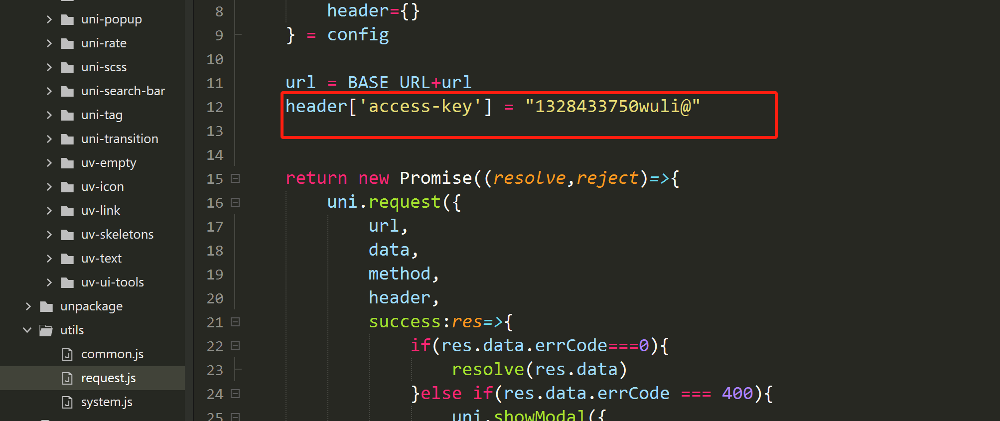

# 零儿爱喵喵壁纸小程序

## 项目简介
基于 uniapp + Vue3 setup 开发的壁纸预览项目，
支持多端运行：微信小程序、APP、H5、PC端。

## 功能特性
- 壁纸swiper左右滑动轮播预览
- 点击图片显示/隐藏顶部底部遮罩栏
- 实时显示当前时间、日期、当前页/总数
- 壁纸信息弹窗：ID、发布者、评分、标签、简介
- 支持半星评分、重复评分拦截
- 多端适配下载壁纸，小程序/APP保存到相册
- H5/PC端支持提示右键保存

## 技术栈
- 框架：uni-app
- 语法：Vue3 script setup>
- 样式：SCSS
- UI组件：uni-ui
- 接口：自定义后端API

## 运行方式

1. 导入 HBuilderX
2. 安装依赖
3. 获取API密钥
- 通过`api.qingnian8.com`，通过看广告获取自定义API密钥，`1328433750wuli@`
或者可以自己自定义，去

将access-key改成自己自定义的密钥KEY
4. 运行到浏览器/小程序模拟器

## 本项目供学习使用
